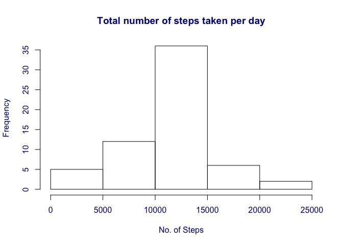

# Reproducible Research: Peer Assessment 1

## Loading and preprocessing the data
The first step is to unzip the data file, then read the data into R.  
(Please put the raw file in the same directory as this document.)


```r
unzip('activity.zip')
data <- read.csv('activity.csv', header = TRUE)
head(data)
```

```
##   steps       date interval
## 1    NA 2012-10-01        0
## 2    NA 2012-10-01        5
## 3    NA 2012-10-01       10
## 4    NA 2012-10-01       15
## 5    NA 2012-10-01       20
## 6    NA 2012-10-01       25
```

## Analysis 1 - What is mean total number of steps taken per day?
Let's do some aggregation to get the total number of steps. The following code aggregate the number of steps for each day.

```r
step_by_date <- aggregate(data$steps, by = list(data$date), FUN = sum)
names(step_by_date) <- c('Date', 'Steps')
summary(step_by_date$Steps)
```

```
##    Min. 1st Qu.  Median    Mean 3rd Qu.    Max.    NA's 
##      41    8841   10760   10770   13290   21190       8
```
Next, let's look at the histogram.

```r
hist(step_by_date$Steps, xlab = 'No. of Steps',
     main = 'Total number of steps taken per day', col.axis = 'darkblue', 
     col.lab = 'darkblue', col.main = 'darkblue')
```

 
  
The mean and median value of total steps per day can be produced:

```r
mean(step_by_date$Steps, na.rm = TRUE)
```

```
## [1] 10766.19
```

```r
median(step_by_date$Steps, na.rm = TRUE)
```

```
## [1] 10765
```
## Analysis 2 - What is the average daily activity pattern?
We want to know the pattern of activity (no. of steps) at each interval. Therefore, need to take the average number of the steps on interval across the dates. Here is the R code to do the aggregation and plotting:

```r
step_by_inv <- aggregate(data$steps, by = list(data$interval), 
                           mean, na.rm = TRUE)
# update the column names for convenience
names(step_by_inv) <- c('Interval', 'Steps')
# plot it out
plot(step_by_inv, type = 'l', xlab = 'Interval', bty = 'n', xaxt = 'n',
     ylab = 'Average number steps across days')
axis(1, at = seq(0, 2400, 300), las = 2)
```

 
  
The following code returns the interval with the maximum average step count.

```r
step_by_inv[which.max(step_by_inv$Steps),'Interval']
```

```
## [1] 835
```
## Analysis 3 - Imputing missing values
Firstly, check how many missing value in raw data:

```r
sum(is.na(data$steps))
```

```
## [1] 2304
```
Next, make up the missing values using the average steps for each interval, that's using the result procedued in previous section:

```r
# merge the raw data and average step by interval together, then replace the missing values with the average steps for that interval
merged <- merge(data, step_by_inv, by.x = 'interval', by.y = 'Interval')
new_data <- transform(merged, steps = ifelse(is.na(steps), Steps, steps))
# do the aggregation again and put proper columns names
step_by_datenew <- aggregate(new_data$steps, by = list(new_data$date), FUN = sum)
names(step_by_datenew) <- c('Date', 'Steps')
summary(step_by_datenew)
```

```
##          Date        Steps      
##  2012-10-01: 1   Min.   :   41  
##  2012-10-02: 1   1st Qu.: 9819  
##  2012-10-03: 1   Median :10766  
##  2012-10-04: 1   Mean   :10766  
##  2012-10-05: 1   3rd Qu.:12811  
##  2012-10-06: 1   Max.   :21194  
##  (Other)   :55
```
  
Let's look at the histogram, and mean & median again:

```r
hist(step_by_datenew$Steps, xlab = 'No. of Steps',
     main = 'Total number of steps taken per day', col.axis = 'darkblue', 
     col.lab = 'darkblue', col.main = 'darkblue')
```

 
  

```r
mean(step_by_datenew$Steps, na.rm = TRUE)
```

```
## [1] 10766.19
```

```r
median(step_by_datenew$Steps, na.rm = TRUE)
```

```
## [1] 10766.19
```
By comparing the mean and median of the steps before and after the manipulation, it appears that the manipulation doesn't affect the mean (as the make-up missing value strategy is using the mean steps) but does change the median value.
  
## Analysis 4 - Activity patterns between weekdays and weekends
To following code manipulates the data by adding a new factor variable, which shows if that date is a weekday, then plot the average steps of each interval on weekday and weekend.  
Please note the plotting is using ggplot2 package.

```r
# first need to create a factor variable based on the manipulated data set using the following code
new_data$Weekday <- factor((weekdays(as.Date(new_data$date)) %in% c("Saturday","Sunday")), 
                          levels = c(TRUE, FALSE), labels = c('weekend', 'weekday'))
# aggregate by both 'Weekday' and 'interval' variables
step_by_inv_weekday <- aggregate(steps ~ Weekday + interval, data = new_data, mean)
# plotting using ggplot2
library(ggplot2)
qplot(interval, steps, data = step_by_inv_weekday, facets = Weekday ~ ., geom = 'line')
```

 
  
It shows that the patterns are different between weekdays and weekends. The subject person being measured starts to be active (= wake up) earlier on weekdays than on weekends; he or she also finishes (stop moving) earlier on weekdays as well. The activity level is more or less smooth out on weekends, while on weekdays there is not to much moving around during the day time. There is also an obious peak on weekdays, which may be explained by the morning rush to work.
